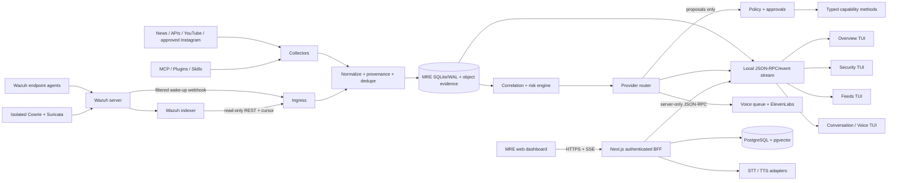

# MRE Master Specification

**Name:** MRE — Modular Research Engine  
**Document version:** 1.0.0-draft  
**Specification date:** 2026-08-10  
**Status:** Authoritative product and architecture baseline  
**Implementation stage:** Foundation scaffold; not production-ready  

This document is the controlling specification for MRE. If a README,
issue, prompt, or implementation detail conflicts with it, this specification
wins until it is changed through a recorded architecture decision.

## 1. Product definition

MRE is an operator-owned, always-on artificial-intelligence agent that
collects authorized information, interprets it, answers questions, presents it
across multiple terminal screens, and protects the operator's computers and
networks. It combines a personal intelligence assistant with a security
operations copilot.

MRE is an agent system, not a newly trained foundation model. Its value is
the orchestration of sources, tools, memory, policy, security telemetry,
specialist models, and human decisions. Model providers must remain replaceable.

The security product is a two-part system:

1. Wazuh supplies the proven SIEM/XDR collection, decoding, rule, index, and
   endpoint data plane.
2. MRE supplies normalization, correlation, prioritization, summaries,
   conversation, multi-screen presentation, approvals, and orchestration.

MRE MUST NOT be described as a complete operational SIEM until the
production acceptance criteria in section 23 are satisfied.

## 2. Normative language

The terms **MUST**, **MUST NOT**, **SHOULD**, **SHOULD NOT**, and **MAY** are
normative. A deviation from MUST or MUST NOT requires an architecture decision
record, a named owner, a risk assessment, and an expiry or review date.

## 3. Goals

MRE MUST:

- Run continuously on an operator-controlled workstation or server.
- Provide an interactive conversational terminal.
- Produce news and intelligence briefings at 05:00, 13:00, and 21:00 in
  `America/New_York`, including daylight-saving-time behavior.
- Ingest news, RSS, permitted websites, APIs, MCP tools, plugins, skills,
  YouTube subscription activity, and supported Instagram data.
- Continuously ingest security events independently of the eight-hour briefing
  schedule.
- Use Wazuh as the security telemetry and endpoint-management data plane.
- Correlate Wazuh alerts with network, asset, threat-intelligence, and isolated
  honeypot evidence.
- Summarize large data volumes so a human can understand important changes
  without reading every source.
- Preserve source links, identifiers, timestamps, and uncertainty behind every
  material conclusion.
- Display different views in multiple simultaneous terminal windows or screens.
- Speak important messages with ElevenLabs and maintain an auditable record of
  every intended, rendered, played, failed, or acknowledged utterance.
- Receive speech and convert it into operator messages.
- Reach explicitly authorized devices over Tailscale and inspect approved files,
  directories, services, and telemetry.
- Support a no- or low-cost primary model plus explicit escalation to locally
  installed Codex or Claude Code sessions authenticated by the operator's
  subscription.
- Enforce policy before every consequential action, regardless of which model
  requested it.
- Keep every capability behind a class with named, typed method calls.

## 4. Non-goals and hard boundaries

MRE MUST NOT:

- Retaliate, “hack back,” exploit, disrupt, or access third-party systems.
- Treat an IP address, username, language, or model inference as verified human
  attribution.
- evade a site's access controls, robots policy, terms, rate limits, or official
  API restrictions.
- Scrape a logged-in Instagram consumer feed or claim that Meta provides a
  supported endpoint for it.
- Claim that Tailscale connectivity automatically grants filesystem authority.
- Extract, copy, replay, or reimplement private OAuth credentials from Codex,
  Claude Code, Hermes, Google, Meta, or any other application.
- Let prose emitted by a model directly execute a containment, deletion,
  firewall, credential, or remote-shell action.
- Send raw secrets, full disk contents, malware, captured credentials, or
  unrestricted security logs to a hosted model.
- Disable TLS verification in a production integration.
- Expose Wazuh ports 55000 or 9200, the local IPC service, a honeypot management
  interface, or model credentials to the public internet.
- Run a honeypot on a trusted workstation or network segment.
- Represent a free hosted model tier or consumer subscription as a production
  service-level agreement.
- Bypass operating-system controls. “Full access” means the service identity has
  been explicitly granted authority by the owner; it does not mean evading a
  permission, endpoint control, or provider safeguard.

## 5. Users and operating modes

### 5.1 Actors

- **Owner/operator:** the human who grants access, receives briefings, asks
  questions, approves actions, and owns the data.
- **MRE service:** the long-running coordinator.
- **MrieNodeAgent:** a future authenticated service on each remote device.
- **Analyst model:** a model that classifies, summarizes, or answers without
  direct authority.
- **Action executor:** deterministic code that validates a signed approval and
  invokes one bounded capability method.
- **External source:** any feed, webpage, API, log line, uploaded document,
  honeypot interaction, or third-party tool result. All are untrusted.

### 5.2 Modes

| Mode | Read/observe | Low-risk action | Destructive/elevated action |
|---|---:|---:|---:|
| `observe` | Allowed within policy | Denied | Denied |
| `assist` | Allowed within policy | Proposed for confirmation | Denied |
| `operate` | Allowed within policy | Allowed only by scoped rule | Time-limited human approval |
| `lockdown` | Local evidence reads only | Denied | Denied |

`observe` is the default. A mode change MUST be logged, scoped, time-limited,
and visible on every screen. A model cannot change mode.

## 6. Trust zones

MRE recognizes these zones:

1. **Trusted control zone:** policy engine, approval service, local state, secret
   references, and operator interface.
2. **Trusted data zone:** normalized events, indexes, summaries, and audit logs.
3. **Managed endpoint zone:** devices with Wazuh and/or MrieNodeAgent enrollment.
4. **Tailnet transport zone:** private connectivity governed by Tailscale grants.
5. **Hostile sensor zone:** honeypots and captured artifacts.
6. **Untrusted content zone:** internet, feeds, social data, documents, MCP
   results, tool output, and all attacker-controlled security fields.
7. **External model zone:** any hosted model or voice provider.

Data moving toward a more trusted zone MUST pass deterministic validation,
normalization, size limits, provenance assignment, and secret/PII handling. Model
output never becomes more trusted merely because it is fluent or confident.

## 7. Functional capabilities

### 7.1 Conversation

- The operator can ask a question at any time.
- Each terminal window has a unique `session_id`; histories MUST NOT race or leak
  across sessions.
- A session can reference shared facts and events, but conversational turns stay
  isolated unless the operator deliberately links them.
- Answers MUST cite source URLs, event IDs, asset IDs, or tool evidence where
  available.
- Answers MUST label inference, uncertainty, stale data, and unavailable sources.
- The MRE web command center persists authenticated conversations and messages on
  the server. Closing a browser MUST NOT discard conversation history.
- Responses stream incrementally. Stop and voice barge-in MUST abort the active
  browser request and audio playback; a cancelled response is never represented
  as a completed action.
- User-facing activity shows short states such as searching memory or waiting
  for approval. Private chain-of-thought is never displayed or stored.

### 7.1.1 Persistent operator memory

MRE maintains three user-scoped memory classes: profile, semantic business
knowledge, and episodic decisions/outcomes. Retrieval combines relevance,
importance, recency, pinned status, confidence, and reuse frequency. Every
answer influenced by memory identifies the memories used.

The operator can search, filter, inspect source, edit, pin, expire, export, and
delete memory independently of conversation history. Automatic memory is an
explicit preference. Only stable, useful facts may be selected; arbitrary
conversation sentences are not memory. Explicit `remember`, `do not remember`,
`what do you remember`, `forget`, and `correct` intents have deterministic
parsers before model involvement. Secrets, payment data, private keys, tokens,
government identifiers, and medical information MUST be rejected by policy.

### 7.2 News and internet intelligence

- RSS/Atom is the preferred zero-key news source.
- News APIs are adapters, not hard dependencies.
- General web search uses a provider-neutral adapter. The bootstrap Brave
  adapter authenticates only to Brave's documented API host, bounds result
  counts, and returns normalized source URLs and snippets as untrusted data.
- Missing, invalid, exhausted, and rate-limited API credentials MUST surface as
  distinct machine-readable failures; an unconfigured search MUST NOT return a
  false successful empty result.
- Web extraction MUST honor HTTPS, redirects, response-size limits, content type,
  rate limits, robots and applicable terms.
- Requests MUST block loopback, link-local, private, metadata-service, broadcast,
  and newly resolved disallowed destinations unless a separate named internal
  source explicitly permits them.
- Raw HTML MUST be archived separately from normalized title, author, published
  time, canonical URL, excerpt, and content hash.
- Duplicate and near-duplicate stories MUST be clustered before model use.
- A briefing MUST distinguish reporting from separate sources from repeated
  syndication of the same report.

### 7.3 YouTube

“My YouTube feed” is defined as recent uploads from the operator's subscribed
channels. The implementation MUST use the official YouTube Data API with the
operator's OAuth grant:

1. `subscriptions.list(mine=true)` obtains authorized subscriptions.
2. `channels.list(part=contentDetails)` resolves each uploads playlist.
3. `playlistItems.list` obtains recent uploads.

The personalized YouTube home/recommendation feed is not available through the
supported API. MRE MUST NOT scrape the logged-in home page. It SHOULD cache
ETags and quota-expensive mappings and summarize metadata/links rather than
download video content.

### 7.4 Instagram

The official Instagram Platform supports professional Business/Creator account
workflows; it does not provide a consumer home/recommendations feed. Supported
MRE inputs are:

- Media and interactions for an authorized professional account.
- Accounts/data for which the app has the required reviewed access.
- A user-provided data export.
- Links or posts manually shared to MRE.

Logged-in scraping and credential/session-cookie reuse are prohibited.

### 7.5 APIs, MCP, plugins, and skills

- An API source implements `Capability` or a narrower source adapter class.
- MCP clients MUST validate server identity, tool schemas, timeouts, maximum
  output, and the server's trust classification.
- A plugin MUST declare capabilities, network destinations, secret references,
  storage, and action risk before activation.
- A skill contains instructions and optional resources; it cannot grant access.
- Method exposure is allowlist-based. A plugin or skill cannot call arbitrary
  Python objects by name.
- All tool calls pass through the same policy and audit path.

### 7.6 Filesystem

- The service can be granted read access to all disks by the operator's OS
  service identity.
- Broad reads are available only in an explicit local policy profile.
- Writes, moves, permission changes, encryption, deletion, and executable launch
  are separate methods with separate policy decisions.
- Destructive requests require a preview containing resolved absolute targets,
  expected effect, recovery method, and expiry-bound approval.
- Symlinks, junctions, mount points, reparse points, path traversal, alternate
  data streams, and device files MUST be resolved before policy evaluation.
- Secret locations and credential stores are denylisted for model-originated
  bulk reads even in broad-read mode.
- Output is size-limited and sensitive values are redacted before model use.

### 7.7 Tailscale devices

- Tailscale supplies authenticated network reachability; device authorization is
  enforced separately by Tailscale grants and MRE policy.
- Remote operations SHOULD use a mutually authenticated MrieNodeAgent with
  allowlisted roots and typed methods.
- Tailscale SSH is permitted only where supported and granted. Windows targets
  require ordinary OpenSSH/SFTP/SMB or MrieNodeAgent.
- Taildrive MAY provide explicitly granted WebDAV shares but MUST be treated as
  experimental while marked alpha upstream.
- An empty device allowlist MUST mean “no remote mutation,” not “all devices.”
- Remote write, delete, service control, package install, or privilege elevation
  requires an operator approval bound to device, method, arguments hash, and
  expiry.

### 7.8 Voice output

- ElevenLabs is the initial TTS provider behind a replaceable `VoiceProvider`.
- MRE MUST append a `planned` speech record before attempting synthesis.
- It MUST then append `rendered`, `render_failed`, `played`, `play_failed`, and
  `acknowledged` state changes as appropriate.
- Each record includes utterance ID, UTC timestamp, text, reason/trigger,
  severity, provider, model, voice, audio hash/path, and delivery state.
- Routine unattended speech SHOULD be suppressed or queued during configured
  quiet hours. Critical speech can override quiet hours only by policy.
- Generated daemon audio MUST use an operator-configurable dedicated storage
  directory with bounded age, file-count, and byte retention. Pruning MUST
  protect the artifact currently in delivery and append `retention_pruned` with
  the prior delivery state; queued audio may expire, but its audit record may
  not be silently erased.
- Spoken alerts are concise; the corresponding TUI view retains full evidence.
- ElevenLabs free output has commercial/attribution limitations. Deployment MUST
  select a plan and usage policy appropriate to the actual use.

### 7.9 Audio input

- A push-to-talk path is the default.
- Wake-word or always-listening operation requires an explicit privacy setting,
  a visible indicator, retention rules, and a hardware/software mute.
- Local Whisper is preferred for private baseline transcription. ElevenLabs STT
  is an optional streaming adapter.
- Audio is never interpreted as an approval for a destructive action unless a
  separate authenticated confirmation protocol is enabled.

## 8. Scheduling and event loops

### 8.1 Intelligence loop

The authoritative schedules are:

| Briefing | Cron | Local time |
|---|---|---:|
| Morning | `0 5 * * *` | 05:00 |
| Afternoon | `0 13 * * *` | 13:00 |
| Evening | `0 21 * * *` | 21:00 |

The scheduler uses IANA zone `America/New_York`, not a fixed UTC offset. These
are wall-clock anchors approximately eight hours apart.

Each run has a unique job ID and a logical window `(previous_success, now]`.
Collection, normalization, deduplication, scoring, summarization, persistence,
delivery, and speech are separate durable stages. If the host was asleep, the
service performs at most one catch-up run for the newest missing window. A
restarted job MUST be idempotent.

### 8.2 Security loop

Security ingestion is continuous and independent of briefings:

- Wazuh webhook notifications wake MRE for low latency.
- Indexer polling reconciles missed webhook deliveries.
- A durable cursor and event ID prevent duplicates.
- Deterministic rules calculate initial severity and grouping.
- Threshold-triggered summaries run without waiting for the next briefing.
- A high or critical event does not automatically authorize containment.

### 8.3 Health loop

At least once per minute the service records provider, source, scheduler, Wazuh,
disk, queue, IPC, and clock health. It alerts on stale cursors, repeated source
failures, quota exhaustion, certificate expiry, low disk, or audit-log failure.

## 9. Logical architecture



### 9.1 Planes

- **Data plane:** collectors, Wazuh, normalizers, durable queues, event/evidence
  storage, and retention.
- **Control plane:** orchestrator, policy, approvals, capability registry,
  scheduler, provider routing, health, and audit.
- **Presentation plane:** Rust TUIs, the MRE Next.js command center, optional
  Hermes windows, voice, and authenticated remote clients.

The planes communicate through versioned data contracts. The TUI MUST NOT
import capability implementations. A model provider MUST NOT access the event
database directly.

## 10. Object model and package boundaries

All capabilities are classes. Public tools are explicit methods represented by
JSON Schema. Composition is preferred over deep inheritance.

### 10.1 Core contracts

- `Capability`: abstract `get_tools()`, `invoke()`, and `ethics_check()`.
- `CapabilityRegistry`: registers unique instances and dispatches typed calls.
- `CapabilityResult`: stable success/data/error envelope.
- `ModelProvider`: provider-neutral `chat()`, `summarize()`, and `get_status()`.
- `ProviderRouter`: primary route plus named, explicit escalation routes.
- `PolicyEngine`: evaluates actor, mode, capability, method, arguments, target,
  provenance, and approval.
- `ApprovalService`: creates and consumes signed, one-use, expiring approvals.
- `EventSource`: polls or receives source events and advances a durable cursor.
- `Normalizer[T]`: transforms a source record into a normalized model.
- `EventStore`: persists normalized records and cursors idempotently.
- `EventSink`: sends a normalized event to a UI, notification, archive, or API.
- `Scheduler`: persists jobs, leases, attempts, and outcomes.
- `LanguageModelProvider`: streams provider-neutral response chunks.
- `SpeechToTextProvider` and `TextToSpeechProvider`: isolate speech vendors.
- `MemoryService`: validates, ranks, retrieves, and mutates user-scoped memory.
- `ChatService`: owns durable turn preparation, context assembly, streaming, and
  completed-turn persistence.
- `WebSearchProvider`: normalizes supported search APIs behind a secret-free
  capability result contract.

### 10.2 Capability classes

- `NewsCapability`
- `WebScrapeCapability`
- `YouTubeCapability`
- `InstagramCapability`
- `MCPCapability`
- `FilesystemCapability`
- `TailscaleCapability`
- `NetworkingCapability`
- `VoiceCapability`
- `AudioInputCapability`
- `SpeechLogCapability`
- `WazuhCapability`
- `HoneypotCapability`

Future classes include `ThreatIntelCapability`, `AssetInventoryCapability`,
`IncidentCapability`, `NotificationCapability`, `MrieNodeCapability`, and
`ApprovalCapability`.

### 10.3 Dependency rule

Dependencies point inward:

```text
capability/integration adapters -> application services -> domain models
presentation adapters ----------> application services -> domain models
infrastructure implementations --> domain interfaces
```

Domain models MUST NOT import HTTP clients, CLIs, Wazuh, Tailscale, ElevenLabs,
provider SDKs, or terminal libraries.

## 11. Data contracts

### 11.1 SecurityEvent

Required fields:

- `event_id`: stable SHA-256 identifier derived from source and source ID.
- `source`, `source_event_id`, and optional upstream index.
- `occurred_at` and `observed_at` in UTC RFC 3339.
- `category`, normalized severity, title, asset, actor indicator, and rule ID.
- Tags and bounded structured evidence.
- Hash/reference to raw evidence; raw attacker text is not copied into prompts by
  default.

Normalized severity is `0 informational`, `1 low`, `2 medium`, `3 high`, and
`4 critical`. The original Wazuh level remains in evidence.

### 11.2 IntelligenceItem

Fields include source ID/type, canonical URL, title, author/publisher, published
and observed times, normalized text reference, language, content hash, cluster
ID, topic labels, source reliability, corroboration count, and trust label.

### 11.3 Briefing

Fields include briefing ID, scheduled/logical window, collection snapshot IDs,
model/provider, claims with evidence references, security priorities, changes
since prior briefing, uncertainty, failures/omissions, text, speech utterance ID,
created time, delivery state, and acknowledgement.

### 11.4 ToolInvocation

Fields include invocation ID, session/actor, capability/method, sanitized
arguments or hash, target, policy version, verdict/reason, approval ID, start/end,
result class, and evidence/audit references. Secrets and captured credentials are
never logged.

### 11.5 Incident

An incident groups immutable source events. It has state, owner, severity,
confidence, assets, indicators, hypotheses, timeline, recommended actions,
approvals, actions taken, and closure rationale. A model may propose but cannot
silently close an incident.

## 12. Wazuh integration

### 12.1 Supported baseline

The initial tested target is Wazuh **4.14.7**. Wazuh 5 is beta at the date of
this specification. MRE MUST version-test APIs and index mappings and MUST NOT
auto-upgrade across a major release.

### 12.2 Deployment topology

```text
Wazuh agents --1514/TCP--> Wazuh server --Filebeat/TLS--> Wazuh indexer
Devices/sensors --agent JSON or protected syslog relay--^        |
                                                               dashboard
MRE ----server API 55000 (read) + indexer API 9200 (read)-------^
Wazuh Integrator ----filtered HTTPS webhook----> MRE ingress
```

- Server API is used for manager health, agents, rules, decoders, inventory, and
  tightly controlled administration.
- Indexer API is used for `wazuh-alerts-*` and approved monitoring/statistics
  queries. The Wazuh dashboard is not a data API.
- The indexer account MUST have a dedicated read-only role limited to required
  index patterns.
- The manager account MUST use allow-only RBAC and only required read actions.
- JWT tokens are short-lived and refreshed without logging them.
- The adapter respects the server API's documented 300 request/minute limit.
- Polling persists a deterministic cursor, uses `search_after`, and upserts by
  stable source ID.
- A webhook is a wake-up hint, not the authoritative delivery channel.
- TLS uses a verified private or public CA. `curl -k` is not an operating plan.
- `wazuh-archives-*` is disabled by default due to volume. Enabling it requires
  sizing, retention, and Index State Management policy.

### 12.3 Wazuh responsibility boundary

Wazuh owns endpoint collection, FIM, inventory, security configuration
assessment, vulnerability and response telemetry, decoding, rules, and the
authoritative searchable alert history. MRE does not fork or copy those
functions. It enriches and interprets them through documented APIs.

### 12.4 Active response

Active response starts disabled. A future action requires:

1. A deterministic rule or analyst request.
2. Evidence and blast-radius preview.
3. A reversible, time-limited action plan.
4. Human approval bound to exact arguments.
5. Independent executor validation.
6. Execution and rollback evidence.
7. Post-action verification.

Management, DNS, NTP, Tailscale, and Wazuh infrastructure require protected
allowlists. Honeypot-only evidence can never independently trigger a block.

## 13. Honeypot design

### 13.1 Phase-one sensor

Use a maintained Cowrie sensor in a dedicated hostile VLAN/DMZ. Add Suricata
`eve.json` for independent network corroboration. A host-level Wazuh agent or
protected relay reads one-line JSON and sends it to the Wazuh manager.

The sensor MUST:

- Have no route to production, management, backup, credential, or control
  networks.
- Contain no real credentials or sensitive data.
- Use deny-by-default, audited egress.
- Keep management on a separate interface/path.
- Store captured files on a quarantined append-only path.
- Send hashes and metadata—not executable bytes—to MRE or a model.
- Synchronize time and preserve raw logs with hashes.

Normalize sensor ID, session ID, source IP/port, protocol, event ID, username,
command category, file hash, malware-analysis reference, and timestamps. Raw
commands, banners, usernames, and passwords are attacker-controlled data and are
excluded from system instructions.

### 13.2 Attribution language

MRE may say “observed source,” “infrastructure indicator,” “behavioral
cluster,” or “likely campaign overlap.” It MUST NOT identify a human or
organization without independent, high-quality corroboration and human review.
Proxies, VPNs, NAT, shared hosting, compromised hosts, and botnets are normal.

### 13.3 T-Pot

T-Pot MAY be evaluated after Cowrie. It is not the default because it changes
firewall/security settings, combines components under multiple licenses, may
send telemetry externally, and some sensors permit outbound artifact retrieval.
It requires a component license review, egress audit, privacy review, and
dedicated host.

## 14. Model and provider strategy

### 14.1 Routing classes

| Route | Intended use | Tool authority | Availability assumption |
|---|---|---|---|
| Local open model | Private classification, redaction, basic summaries | None | Operator hardware |
| Free hosted primary | General questions and bounded summaries | MRE read tools by policy | Best effort; no SLA |
| Codex subscription | Explicit specialist escalation | Official read-only CLI sandbox; no MRE tools | User session/quota |
| Claude Code subscription | Explicit specialist escalation | Built-in tools disabled; no MRE tools | User session/quota |
| Paid API | Production fallback if configured | Per policy | Contract/API limits |

Security classification, deduplication, severity floors, approvals, and action
selection MUST be deterministic. Models assist; they do not become the policy
engine.

### 14.2 Free/low-cost route

The provider interface is OpenAI-compatible where practical. Candidate hosted
developer/free routes at the specification date are:

- GroqCloud Free, with published per-model RPM/RPD/TPM/TPD limits.
- NVIDIA hosted NIM endpoints for prototyping/developer use.
- OpenRouter free models as a low-volume, variable-availability fallback.
- DeepSeek as a low-cost paid API, not a guaranteed free endpoint.

The bootstrap code uses NVIDIA NIM. Before production, add local quota tracking,
timeouts, retry budgets, a circuit breaker, model capability checks, and at
least one fallback. Free tiers can change at any time and MUST be health-checked.

### 14.3 Subscription-backed frontier routes

Codex supports ChatGPT-plan login and `codex exec` for trusted scripts. MRE may
invoke the locally installed official CLI or official local SDK. It MUST never
read or redistribute `~/.codex/auth.json`; that file is a password. Subscription
usage is limited/shared and is not an API entitlement or 24×7 SLA.

Claude Code supports subscriber login and noninteractive `claude -p`. MRE may
invoke the operator's installed CLI as a user-authorized local tool. Anthropic's
Agent SDK terms do not permit a third-party product to offer claude.ai login or
subscription rate limits as its embedded backend without approval. An embedded
or multi-user MRE service therefore uses an approved arrangement or API key.

Raw web or security content MUST NOT be sent directly to either agentic CLI.
Only explicit operator questions or sanitized, bounded structures qualify for
frontier escalation. Provider credentials remain owned by official clients.

### 14.4 Data routing

Every request receives a data classification: public, internal, confidential,
restricted, credential, or malware. Provider policy maps classification to
allowed destinations. Credential and malware classes never leave the trusted
zone. Restricted content requires explicit provider authorization and redaction.

## 15. Prompt-injection and model safety

- All external text is wrapped and labeled as untrusted data.
- Instructions inside articles, tool results, logs, filenames, comments,
  metadata, transcripts, or attacker input are ignored.
- Collection and action contexts are separate. A summarizer has no action tools.
- Tool arguments are generated into schemas, validated, then re-authorized by
  deterministic code.
- High-risk methods require an approval token that a model cannot mint.
- Output encoding and UI rendering MUST prevent terminal escape/control-sequence
  injection.
- URLs are normalized and rendered without automatic execution.
- Secrets are redacted before logging and provider calls.
- A model cannot lower severity below a deterministic floor or erase evidence.
- Model/provider identity and prompt-template version are recorded with every
  material summary.

## 16. Multi-screen terminal experience

The Rust TUI uses `ratatui` and connects to a loopback JSON-RPC/event endpoint.
Multiple instances can run simultaneously with `--view`:

- `overview`: system health, next briefing, urgent items, provider/quota status.
- `security`: live alerts, incidents, severity rollups, Wazuh/agent health.
- `feeds`: news/social source health, clusters, briefing queue.
- `conversation`: questions, answers, tool proposals, approvals.
- `voice`: planned/rendered/played speech and microphone state.

Each instance has a unique client and session ID. Read views share data, but
conversation state is isolated. The protocol eventually supports subscriptions,
sequence IDs, reconnect/backfill, backpressure, and version negotiation.

Loopback is the default and only bootstrap bind. A remote TUI requires mutual
TLS or a Tailscale-bound authenticated service, client identity, authorization,
and replay protection. Binding `0.0.0.0` without these controls is prohibited.

The interface MUST show:

- Current mode and policy state at all times.
- Data staleness and unavailable sources.
- Whether text is model inference or source evidence.
- Action risk and approval status.
- Provider and quota route.
- An obvious panic/lockdown command.

### 16.1 MRE web command center

`apps/web` is the authenticated XynPrize presentation/BFF application. MRE
is both the assistant identity and the underlying intelligence/security engine;
XynPrize is the company brand. The browser never opens MRE's raw TCP socket and never
receives provider credentials.

Desktop uses a collapsible navigation zone, a central command canvas, and a
collapsible intelligence zone. The central original SVG/CSS AI core exposes
idle, listening, processing, speaking, success, error, and offline states.
Tablet moves intelligence into a drawer; mobile becomes a voice-first single
column with bottom navigation. Primary routes cover conversations, agents,
automations, scheduling, memory, knowledge, integrations, and settings.

Voice capture requires an explicit secure-context microphone grant. Push-to-talk
is the default; hands-free is opt-in with a persistent privacy indicator. Web
Audio supplies the input meter and visual reaction. Browser recognition and
speech synthesis are credential-free fallbacks; server-side adapters provide
ElevenLabs transcription and synthesis. Captions remain available, Stop cancels
generation and playback, device errors retain text-only operation, and no actor
or protected character voice may be selected or marketed.

The web UI meets keyboard, focus, screen-reader, non-color status, caption,
reduced-motion, high-contrast, touch, and responsive requirements. Expensive
animation pauses in background tabs and is reduced for low-power or
reduced-motion clients. The visual language is an original XynPrize system;
third-party film/game interface assets and sounds are prohibited.

Production mutations enforce authenticated user ownership in route handlers.
Next.js proxy routing is only an early redirect, never the authorization
boundary. Consequential automations require a signed, scoped, expiring
confirmation. A durable single-use approval record remains required before
external business connectors can perform consequential actions.

## 17. Hermes and Warp incorporation

### 17.1 Hermes Agent

Hermes is MIT-licensed and currently vendored at commit
`33f8e96a72945afb29f3bc9ef9991940f0bedcf7`. Its copyright and license notice
MUST be preserved.

MRE SHOULD reuse Hermes through stable boundaries for provider resolution,
MCP, skills/plugins, cron/gateway concepts, and optional dashboard/multi-window
presentation. It SHOULD NOT import private credential/OAuth implementation or
bind core domain models to unstable Hermes internals. Supported patterns are:

1. A separate Hermes service with a versioned MRE plugin/API.
2. A subprocess or app-server adapter that leaves authentication with Hermes.
3. Selective code reuse with attribution, tests, and a maintained compatibility
   layer.

The canonical MRE security event store and policy engine remain independent.

The MRE web control plane implements the separate-service pattern for
conversational turns. Its server-only `HermesLanguageModelProvider` connects to
`hermes serve` using the vendored JSON-RPC/WebSocket contract, creates or
resumes a Hermes session, submits the prompt, consumes public
stream/status/tool events, and maps Stop to `session.interrupt`. It does not
import the Hermes dashboard or expose the gateway credential to browser code.
The bridge requires Hermes manual approval mode by default, disables
per-session YOLO, denies interactive approval events, and fails closed on
secret/sudo/clarification prompts until MRE has a durable operator-response card
bridge. OAuth ticket minting for a gated remote Hermes gateway remains future
work; the supported deployment is a loopback token-bound `hermes serve`
process.

### 17.2 Warp

The current Warp client repository is mixed-license: the explicitly identified
`warpui_core`/`warpui` UI crates are MIT; other client code is AGPL-3.0. MRE's
default integration is to run as an optional external terminal/profile or use
Warp's supported inference features. Copying, linking, modifying, or network
deploying AGPL components requires compliance review and corresponding-source
obligations. Any reuse of MIT UI crates requires notices and an API/license
audit at the pinned revision.

MRE MUST NOT imply that Warp cloud/Oz services are bundled. No Warp source is
vendored until an architecture decision records the exact crates, revision,
license obligations, and maintenance plan.

## 18. Storage, retention, and audit

### 18.1 Stores

- SQLite in WAL mode is the bootstrap control/event cache.
- Wazuh indexer is authoritative for Wazuh alerts.
- Raw articles and large evidence use content-addressed object storage.
- Captured malware uses a separate quarantine store inaccessible to models.
- Secrets use the OS keyring or an approved secret manager, never YAML or Git.
- PostgreSQL is authoritative for MRE users, sessions, conversations, messages,
  memory, preferences, agent runs, automations, schedules, approvals, and web
  audit events. `pgvector` supplies the vector-search storage/index boundary.
- Single-workstation local mode persists to an initially empty server-side
  `.xyn/local-store.json`; it never seeds sample operational records. Browser
  `localStorage` is never the authoritative conversation or memory store.

### 18.2 Retention classes

Retention is configurable by source and legal need. Defaults proposed for pilot:

- Audit/policy decisions: 400 days.
- Incidents and evidence references: 400 days.
- Normalized Wazuh cache: 30 days; authoritative index per Wazuh policy.
- News normalized text: 30 days; metadata/hash longer if permitted.
- Speech metadata: 90 days; audio 30 days unless retained by operator.
- Microphone source audio: delete after transcription by default.
- Honeypot raw logs: 90 days; captured artifacts per legal/quarantine policy.

Deletion MUST be logged without preserving the deleted sensitive payload in the
log. Backups follow the same classification and retention.

### 18.3 Audit properties

Audit logs are append-only, UTC, sequence-numbered, integrity-chained or shipped
to Wazuh, secret-redacted, and monitored for write failure. The service fails
closed for consequential actions if it cannot write an audit decision.

## 19. Secrets and identity

- Configuration stores environment/keyring references, never secret values.
- Separate service identities exist for Wazuh manager reads, indexer reads,
  voice, social APIs, and remote nodes.
- OAuth uses least scopes and documented flows.
- Tokens are rotated/revoked and never printed by `doctor` or status endpoints.
- TUI and node clients have unique identities.
- The local service SHOULD use OS service management and a dedicated account in
  production.
- Broad disk access is never combined with an internet-exposed control endpoint.

## 20. Reliability and performance requirements

- The service restarts automatically and resumes durable cursors/jobs.
- Source failure is isolated; one feed cannot terminate the scheduler.
- Every network call has connect/read/total timeout, response limit, and bounded
  retry with jitter.
- Retry budgets prevent rate-limit amplification.
- At-least-once ingestion plus idempotent upsert is the baseline.
- Security alert display target: under 10 seconds from webhook under nominal
  conditions; under one poll interval without webhook.
- TUI input target: under 100 ms local rendering latency.
- Overview status target: under 2 seconds from local cache.
- Graceful model degradation: collection and deterministic security processing
  continue while all models are unavailable.
- Graceful voice degradation: text and logs remain available if TTS fails.
- MRE command input and navigation target under 100 ms local response; model
  output begins streaming as soon as the provider yields its first safe chunk.
- Core graphics prefer SVG/CSS and pause or reduce non-essential motion when the
  page is hidden, reduced motion is requested, or device capability is low.

## 21. Testing strategy

### 21.1 Unit tests

- Capability registry uniqueness and method schema.
- Policy/path/device/URL evaluation.
- Wazuh severity mapping and malformed alert handling.
- Cursor advancement, dedupe, and retention.
- Secret redaction and untrusted-content framing.
- Schedule/DST/catch-up/idempotency.
- Provider routing and quota/circuit state.
- Speech state transitions.

### 21.2 Contract tests

- Mock Wazuh server authentication, token refresh, 429, malformed response, and
  verified TLS behavior.
- Mock indexer pagination/search-after and mapping variations.
- YouTube OAuth expiry/quota behavior.
- ElevenLabs TTS/STT response and failure shapes.
- Tailscale/MrieNode identity and allowlist enforcement.
- MCP initialization, schema, output-size, and timeout behavior.

### 21.3 Adversarial tests

- Prompt injections in article text, Wazuh description, Cowrie command, filename,
  transcript, MCP result, and model output.
- SSRF, DNS rebinding, redirects to private hosts, decompression bombs, terminal
  escape sequences, path traversal, symlink/junction escape, command option
  injection, and malicious archives.
- Forged approvals, expired/replayed approval tokens, concurrent sessions, and
  audit failure.

### 21.4 Integration and acceptance tests

- Synthetic Wazuh endpoint events flow to indexer, MRE cache, security TUI, and
  a cited summary.
- Cowrie sample JSON maps through Wazuh rules into a honeypot incident.
- Three briefings run across DST boundaries without duplicate delivery.
- Four simultaneous TUI views maintain isolated conversations and recover after
  service restart.
- Model and ElevenLabs outages do not stop security ingestion.
- No active response occurs without a valid approval.

## 22. Deployment profiles

### 22.1 Developer workstation

- Python service and Rust TUI on loopback.
- SQLite local state.
- Wazuh optional all-in-one lab or mocked.
- No public honeypot.
- Subscription CLI adapters explicit and local only.

### 22.2 Home/lab pilot

- Dedicated always-on MRE host.
- Wazuh single-node deployment on a separate host/VM where possible.
- Wazuh agents on enrolled endpoints.
- Tailscale grants and allowlisted remote nodes.
- Isolated Cowrie/Suricata VM/VLAN.
- Backups, retention, quiet hours, and notification channel.

Official Wazuh Docker guidance calls for at least 4 cores, 8 GB RAM, and 50 GB
for its container deployment. Capacity is validated against endpoint count and
retention rather than assumed.

### 22.3 Production

- Separate MRE and Wazuh services.
- Clustered Wazuh managers/indexers as required, load balancing, independent
  backups, CA-issued certificates, private networking, and monitoring.
- Durable queue and production database if SQLite limits are reached.
- Dedicated service identities and secret manager.
- Authenticated presentation clients.
- Change control, tested recovery, legal/privacy review, and incident runbooks.

Wazuh Cloud is not the default for deep integration because server/indexer APIs
are disabled by default and require support enablement with read-only limits.

## 23. Delivery phases and exit criteria

### Phase 0 — foundation (current)

- Repository instructions and master specification.
- Python capability/provider contracts and runnable CLI.
- Rust multi-view TUI bootstrap.
- Configuration and secret-reference examples.
- Normalized security events, SQLite/WAL store, read-only Wazuh adapter, passive
  honeypot view.
- Local Codex/Claude subscription adapters that leave credentials with official
  CLIs.
- Initial tests and CI-ready commands.

Exit: clean install, unit tests pass, daemon/TUI handshake works, dry-run
briefing works without credentials, and no secret is committed.

### Phase 1 — dependable personal intelligence

- Durable scheduler/jobs, source isolation, article extraction, canonicalization,
  dedupe/clustering, source evidence, provider failover, YouTube OAuth, supported
  Instagram/manual intake, briefing archive, and text delivery.

Exit: 30-day pilot with at least 99% scheduled-run completion excluding planned
host downtime, no duplicate briefing, and cited/traceable claims.

### Phase 2 — voice and presentation

- Streaming TTS playback, local/optional streaming STT, quiet hours, speech
  acknowledgement, event subscriptions, all five TUI views, reconnect/backfill,
  MRE web command center, and optional Hermes dashboard/plugin.

Exit: multi-screen soak test, speech state audit complete, privacy controls
verified, and model/voice outage behavior accepted.

### Phase 3 — sentinel pilot

- Supported Wazuh deployment, endpoint agents, certificates, least-privilege
  accounts, continuous reconciliation, incidents, asset inventory, Wazuh health,
  retention, security summaries, and alert notification.

Exit: synthetic event coverage, stale-pipeline alerts, restore test, role review,
and zero write/active-response permission in MRE.

### Phase 4 — isolated honeypot

- Cowrie + Suricata hostile-zone deployment, Wazuh JSON collection and custom
  rules, malware quarantine metadata, correlation, legal/privacy/retention
  review, and egress validation.

Exit: containment test proves no route to trusted networks, captured artifact
cannot reach a model, and attribution wording passes review.

### Phase 5 — controlled response and remote nodes

- MrieNodeAgent, signed requests, scoped approvals, MFA/expiry, preview/rollback,
  device grants, immutable audit, and a small reversible action catalog.

Exit: red-team approval bypass tests pass; rollback and protected allowlists are
verified; every action has source evidence and operator identity.

### Full-SIEM acceptance gate

MRE can be called an operational full SIEM only when:

- All in-scope endpoints and network sources are inventoried and monitored.
- Wazuh collection/rules/indexer/dashboard are deployed, sized, backed up, and
  monitored.
- Log retention and access controls meet the operator's requirements.
- Detection coverage, false-positive handling, escalation, incident workflow,
  recovery, and audit have been exercised.
- MRE's cursor, summary, evidence, multi-screen, and degradation paths pass
  acceptance tests.
- A human owns response decisions and active response remains controlled.

## 24. Current implementation status

| Area | Bootstrap status | Production gap |
|---|---|---|
| Capability OOP boundary | Implemented | Typed per-method classes and plugin manifests |
| Primary LLM | NVIDIA NIM adapter | Quota/circuit/fallback/local provider |
| Codex/Claude subscription | Explicit local CLI adapters | Usage telemetry, policy hardening, provider tests |
| Scheduler | In-process cron loop plus SQLite briefing archive, logical evidence windows, atomic slot leases, latest-slot catch-up, idempotency, active-run phases, and durable non-blocking delivery queue | External worker/queue, multi-instance lease testing, retry policy and acknowledgement |
| Proactive event bus | In-process pub/sub + short-interval Wazuh/honeypot poll watcher, IPC subscribe/push | Persistent dedup across restarts, webhook-driven sources, apps/web consumer |
| News/web retrieval | RSS collection, NewsAPI diagnostics, HTTPS extraction, optional provider-neutral Brave web search | Extraction normalization, provenance archive, caching, dedupe, provider failover |
| YouTube | OAuth API bootstrap | Token lifecycle, ETags, quota cache |
| Instagram | Constraint-aware stub | Authorized professional API/manual intake |
| Wazuh | Read-only manager/indexer adapter, honest connectivity probes, normalized event cache, and live read-only web console | Tested deployment, webhook ingress, durable incidents, asset inventory, and active-response approvals |
| Security store | SQLite/WAL normalized cache | Retention, migrations, raw evidence references |
| Honeypot | Passive cached-event view | Isolated sensor/Wazuh rules/quarantine |
| Voice | Replaceable ElevenLabs TTS adapter, auditable delivery states, quiet-hours policy, optional bounded ffplay/Windows media playback, durable non-blocking briefing delivery worker with conservative crash recovery | Streaming playback, quiet-hours audio retry, acknowledgement |
| Audio input | Interface stub | Local/streaming STT and privacy controls |
| Tailscale | CLI inventory/ping/gated SSH | MrieNodeAgent, grants, approval state machine |
| Rust TUI | Bootstrap client | Streaming, polished per-view models, auth |
| Hermes | Pinned vendor source + MRE JSON-RPC/WS provider | Durable approval/clarification cards; OAuth-ticket remote gateway |
| Warp | External integration decision | Optional profile or reviewed MIT-crate reuse |
| Approval workflow | Signed, tenant-scoped, expiring, single-use Automation Run approvals with immutable audit and atomic queue insertion | Extend the durable approval service to every consequential connector |
| MRE web dashboard | Responsive command center, streaming chat, voice capture/playback, history, memory, agents/automations/scheduling, evidence-backed Briefings archive, and live read-only Sentinel pages | Production connector execution, resumable run event streams, push delivery, and multi-instance load test |
| Web persistence | PostgreSQL/pgvector migration plus empty server-persisted local adapter | Backup/restore drill, managed object storage, embedding backfill |
| Web authentication | Password sessions, secure cookie, same-origin and per-route ownership checks | SSO/MFA, email lifecycle, session/device administration |
| Web providers | OpenAI-compatible/NVIDIA, MRE bridge, Hermes JSON-RPC/WS bridge, browser speech, ElevenLabs STT/TTS | Provider circuit breaker, quota telemetry, approved production voice |

## 25. Licensing and distribution

- MRE is MIT-licensed by the root `LICENSE`; third-party components retain
  their own licenses and notices.
- Hermes reuse is MIT with notice preservation.
- Wazuh core/agent/rules are GPLv2. Wazuh remains independently installed and is
  integrated through documented network APIs. Bundling or copying code/rules
  requires GPL compliance and legal review.
- Wazuh indexer/dashboard are Apache-2.0 projects; notices still apply.
- Warp non-UI client code is AGPL-3.0; only specifically identified UI crates are
  MIT. Review the exact pinned revision before reuse.
- Cowrie and T-Pot/components require their own notices and distribution review.
- Model output and social/news content retain provider/source terms and rights.
- Wazuh and other trademarks MUST follow their published policies; MRE does not
  imply affiliation.

## 26. Open decisions with safe defaults

1. **Primary free model:** benchmark Groq, NVIDIA NIM, and a local model on MRE
   tasks. Default remains NVIDIA during bootstrap; no production promise.
2. **Always-on host:** use a dedicated Linux host/VM for pilot; the Windows
   workstation remains a client if feasible.
3. **Remote node protocol:** prefer a small mutually authenticated node service
   over arbitrary SSH commands.
4. **Database split:** MRE's bootstrap security/control cache remains SQLite;
   MRE's multi-user product records use PostgreSQL/pgvector from the outset.
5. **Hermes integration:** begin with a service/plugin boundary, not a fork.
6. **Warp integration:** external terminal/profile by default; no AGPL code copied.
7. **Voice urgency policy:** only high/critical security and operator-requested
   speech may play unattended; quiet hours and acknowledgement are required.
8. **Honeypot geography/legal basis:** no public exposure before owner review.

## 27. Primary references

These are design inputs, not a substitute for version-pinned implementation
tests.

### Wazuh and sensors

- [Wazuh 4.14.7 release notes](https://documentation.wazuh.com/current/release-notes/release-4-14-7.html)
- [Wazuh architecture and default ports](https://documentation.wazuh.com/current/getting-started/architecture.html)
- [Wazuh server API](https://documentation.wazuh.com/current/user-manual/api/getting-started.html)
- [Wazuh indexer API](https://documentation.wazuh.com/current/user-manual/indexer-api/getting-started.html)
- [Wazuh index patterns](https://documentation.wazuh.com/current/user-manual/wazuh-indexer/wazuh-indexer-indices.html)
- [Wazuh external integrations](https://documentation.wazuh.com/current/user-manual/manager/integration-with-external-apis.html)
- [Wazuh JSON log collection](https://documentation.wazuh.com/current/user-manual/reference/ossec-conf/localfile.html)
- [Wazuh Active Response warning](https://documentation.wazuh.com/current/user-manual/capabilities/active-response/index.html)
- [Cowrie output event schema](https://docs.cowrie.org/en/latest/OUTPUT.html)
- [T-Pot repository and warnings](https://github.com/telekom-security/tpotce)

### Agent runtimes, terminals, and models

- [Hermes Agent repository](https://github.com/NousResearch/hermes-agent)
- [Hermes architecture](https://hermes-agent.nousresearch.com/docs/developer-guide/architecture)
- [Warp repository](https://github.com/warpdotdev/warp)
- [OpenAI Codex authentication](https://developers.openai.com/codex/auth/)
- [Codex non-interactive mode](https://learn.chatgpt.com/docs/non-interactive-mode)
- [Claude Code CLI](https://code.claude.com/docs/en/cli-usage)
- [Claude Code authentication/CI](https://code.claude.com/docs/en/iam)
- [Claude Agent SDK boundary](https://code.claude.com/docs/en/agent-sdk/overview)
- [NVIDIA NIM hosted/self-hosted modes](https://docs.api.nvidia.com/nim/docs/run-anywhere)
- [Groq rate limits](https://console.groq.com/docs/rate-limits)
- [DeepSeek pricing](https://api-docs.deepseek.com/quick_start/pricing)

### Sources, voice, and private networking

- [Brave Web Search API](https://api-dashboard.search.brave.com/api-reference/web/search/get)
- [NewsAPI Everything endpoint](https://newsapi.org/docs/endpoints/everything)
- [NewsAPI error codes](https://newsapi.org/docs/errors)
- [YouTube subscriptions.list](https://developers.google.com/youtube/v3/docs/subscriptions/list)
- [YouTube uploads playlist workflow](https://developers.google.com/youtube/v3/guides/implementation/videos)
- [Instagram Platform overview](https://developers.facebook.com/docs/instagram-platform/overview)
- [ElevenLabs streaming TTS](https://elevenlabs.io/docs/api-reference/streaming)
- [ElevenLabs real-time STT](https://elevenlabs.io/docs/eleven-api/guides/how-to/speech-to-text/realtime/client-side-streaming)
- [Tailscale device connectivity](https://tailscale.com/kb/1452/connect-to-devices)
- [Tailscale grants](https://tailscale.com/docs/features/access-control/grants)
- [Tailscale SSH](https://tailscale.com/docs/features/tailscale-ssh)
- [Taildrive](https://tailscale.com/docs/features/taildrive)
